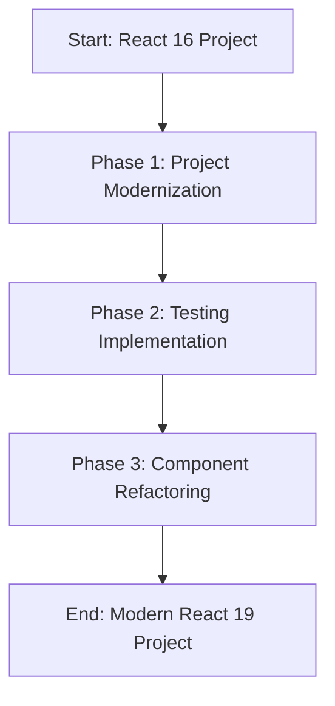

# React 16 to React 19 Modernization Workflow

This guide provides a structured approach to modernizing your React 16 project to React 19 with TypeScript and modern best practices. Follow these steps in order.

## Prerequisites

Before starting, ensure you have:
- A React 16 project you want to modernize
- [Cursor](https://cursor.sh/) installed (recommended for optimal modernization experience)
- Node.js v18+ installed
- Git repository with a clean working tree
- Backup of your project

## Workflow Overview



## Phase 1: Project Modernization

Follow `PROJECT_MODERNIZATION_GUIDE.md` to:
1. Update project dependencies to React 19
2. Add TypeScript infrastructure
3. Set up modern project structure
4. Configure testing frameworks
5. Handle breaking changes
6. Get the project running in React 19

**Success Criteria for Phase 1:**
- [ ] Project builds successfully with React 19
- [ ] TypeScript is configured and running
- [ ] No runtime errors in the console
- [ ] All testing frameworks are configured
- [ ] Project structure follows modern conventions

## Phase 2: Testing Implementation

Before refactoring any components, implement your testing strategy. Follow the `TESTING_GUIDE.md` for a comprehensive overview of the testing approach.

### Choose Your Testing Approach:

1. **Full Testing Suite**
   - Unit Tests (React Testing Library)
     - Follow `UNIT_TESTING_RULES.md` for component-level testing
   - Integration Tests
     - Follow `INTEGRATION_TESTING_RULES.md` for component interaction testing
   - E2E Tests (Cypress)
     - Follow `CYPRESS_E2E_TESTING_RULES.md` for user flow testing

2. **E2E Only**
   - Follow `CYPRESS_E2E_TESTING_RULES.md`
   - Focus on critical user paths
   - Suitable for:
     - Smaller projects
     - Time-constrained projects
     - Projects with heavy user interactions
     - Projects where component isolation is less critical

3. **Unit Tests Only**
   - Follow `UNIT_TESTING_RULES.md`
   - Focus on component-level testing
   - Suitable for:
     - Library projects
     - Highly isolated components
     - Projects with complex business logic
     - Projects where component reusability is critical

### Testing Implementation Steps:

1. Select components for testing based on:
   - Business criticality
   - Complexity
   - User interaction frequency
   - Dependencies on other components

2. For each selected component:

   a) **If using Full Testing Suite:**
      1. Start with Unit Tests (`UNIT_TESTING_RULES.md`)
         - Test component in isolation
         - Test props and state
         - Test event handlers
      2. Add Integration Tests (`INTEGRATION_TESTING_RULES.md`)
         - Test component interactions
         - Test data flow
         - Test context/state management
      3. Create E2E Tests (`CYPRESS_E2E_TESTING_RULES.md`)
         - Test complete user flows
         - Test real-world scenarios
         - Test browser interactions

   b) **If using E2E Only:**
      1. Follow `CYPRESS_E2E_TESTING_RULES.md`
         - Focus on user workflows
         - Test critical business processes
         - Ensure full feature coverage
         - Include error scenarios

   c) **If using Unit Tests Only:**
      1. Follow `UNIT_TESTING_RULES.md`
         - Comprehensive component testing
         - Mock dependencies
         - Test edge cases
         - Test error handling

3. Document test coverage and results:
   ```markdown
   # Component Test Documentation
   
   ## ComponentName
   
   ### Test Strategy: [Full/E2E/Unit]
   
   #### Coverage:
   - [ ] Unit Tests: XX%
   - [ ] Integration Tests: XX%
   - [ ] E2E Tests: Key flows covered
   
   #### Key Test Cases:
   1. Feature A
      - Happy path
      - Error scenarios
   2. Feature B
      - Data validation
      - Edge cases
   ```

### Testing Success Criteria:

Based on chosen strategy, ensure:

**Full Testing Suite:**
- [ ] Unit tests pass with >80% coverage
- [ ] Integration tests verify component interactions
- [ ] E2E tests cover critical user paths
- [ ] All test types documented in test plan

**E2E Only:**
- [ ] All critical user flows covered
- [ ] Edge cases and error scenarios tested
- [ ] Performance scenarios included
- [ ] Test scenarios documented

**Unit Tests Only:**
- [ ] >90% component coverage
- [ ] All props and states tested
- [ ] Edge cases covered
- [ ] Mocks and stubs documented

### Testing Tools Setup:

1. **Unit & Integration Testing:**
   ```bash
   # Install dependencies
   npm install --save-dev @testing-library/react @testing-library/jest-dom @testing-library/user-event jest

   # Add test scripts to package.json
   {
     "scripts": {
       "test": "jest",
       "test:watch": "jest --watch",
       "test:coverage": "jest --coverage"
     }
   }
   ```

2. **E2E Testing:**
   ```bash
   # Install Cypress
   npm install --save-dev cypress

   # Add Cypress scripts
   {
     "scripts": {
       "cypress:open": "cypress open",
       "cypress:run": "cypress run",
       "test:e2e": "cypress run"
     }
   }
   ```

### Common Testing Pitfalls:

1. **Incomplete Test Coverage**
   - Solution: Use coverage reports
   - Follow guide-specific checklists

2. **Brittle Tests**
   - Solution: Follow best practices in respective guides
   - Use proper selectors (data-testid)

3. **Slow Tests**
   - Solution: Use appropriate test type
   - Follow performance tips in guides

4. **Missing Edge Cases**
   - Solution: Use test case templates
   - Follow guide checklists

## Phase 3: Component Refactoring

Follow `REFACTORING_RULES.md` to:
1. Convert class components to functional components
2. Add TypeScript types
3. Modernize code patterns
4. Verify tests continue to pass

### Component Selection Order:

1. Start with leaf components (no child components)
2. Move to container components
3. Finally, refactor page-level components

### For Each Component:

1. Verify tests are in place and passing
2. Follow refactoring rules
3. Run tests after refactoring
4. Document any breaking changes
5. Move to next component

**Success Criteria for Phase 3:**
- [ ] All selected components are refactored
- [ ] TypeScript types are properly implemented
- [ ] All tests continue to pass
- [ ] No regression in functionality
- [ ] Documentation is updated

## Using Cursor for Modernization

Cursor provides several features that make this modernization process more efficient:

1. **Project Analysis**
   - Use Cursor's codebase search for identifying components
   - Analyze dependencies and imports
   - Identify usage patterns

2. **Automated Refactoring**
   - Convert class components to functional components
   - Add TypeScript types
   - Update import statements
   - Fix common patterns

3. **Testing Support**
   - Create test files with proper structure
   - Navigate between tests and components
   - Run tests and view results

4. **Code Navigation**
   - Quick file switching
   - Symbol search
   - Reference finding

## Common Pitfalls to Avoid

1. **Don't Skip Phases**
   - Complete each phase before moving to the next
   - Don't start refactoring before tests are in place

2. **Don't Refactor Too Much at Once**
   - Work on one component at a time
   - Verify changes before moving on

3. **Don't Ignore TypeScript Errors**
   - Fix type issues as they arise
   - Don't use `any` type as a quick fix

4. **Don't Skip Testing**
   - Ensure tests cover critical functionality
   - Don't compromise on test quality

## Progress Tracking

Create a tracking document:

```markdown
# Modernization Progress

## Phase 1: Project Modernization
- [ ] React 19 Update
- [ ] TypeScript Setup
- [ ] Project Structure
- [ ] Testing Framework Setup

## Phase 2: Testing Implementation
Components to Test:
- [ ] ComponentA
- [ ] ComponentB
- [ ] ComponentC

## Phase 3: Refactoring
Components to Refactor:
- [ ] ComponentA
- [ ] ComponentB
- [ ] ComponentC
```

## Need Help?

If you encounter issues:
1. Check the relevant guide (`PROJECT_MODERNIZATION_GUIDE.md` or `REFACTORING_RULES.md`)
2. Review common pitfalls section
3. Consult React 19 documentation
4. Search for similar issues in the community

## Final Checklist

Before considering the modernization complete:
- [ ] All phases are completed
- [ ] All tests pass
- [ ] No TypeScript errors
- [ ] No console errors
- [ ] Documentation is updated
- [ ] Build process is successful
- [ ] Application works in production mode 